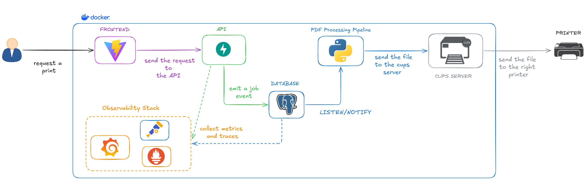
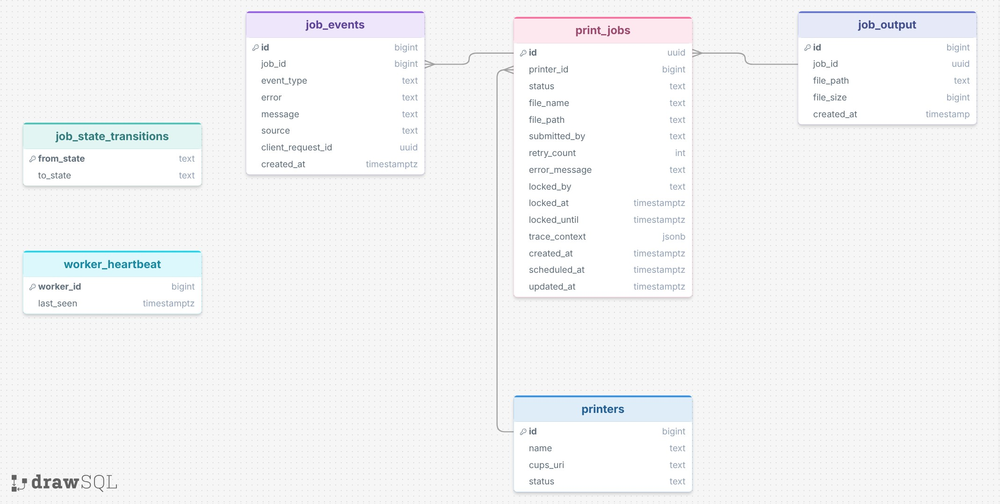
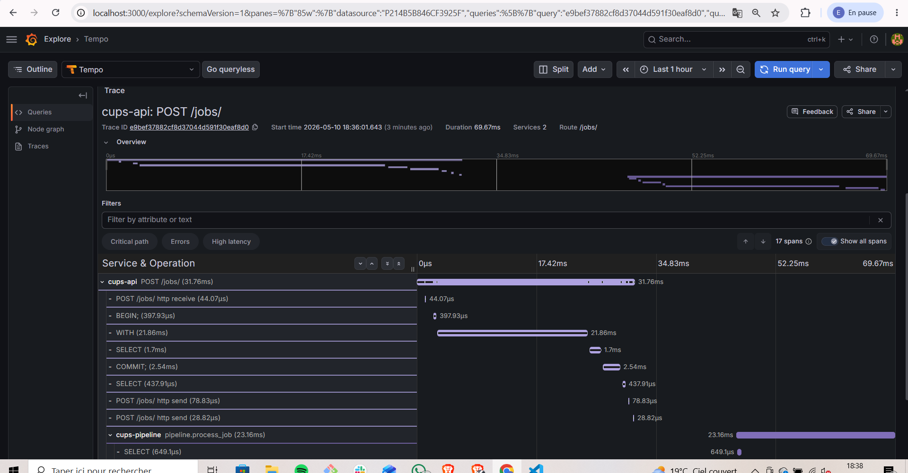
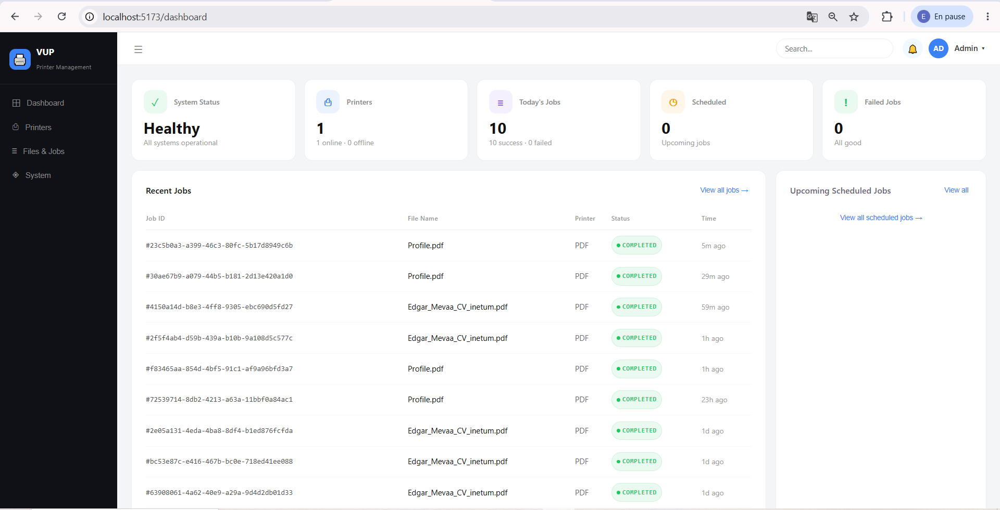
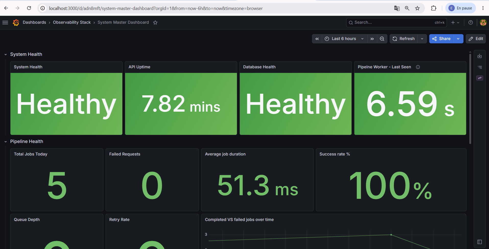
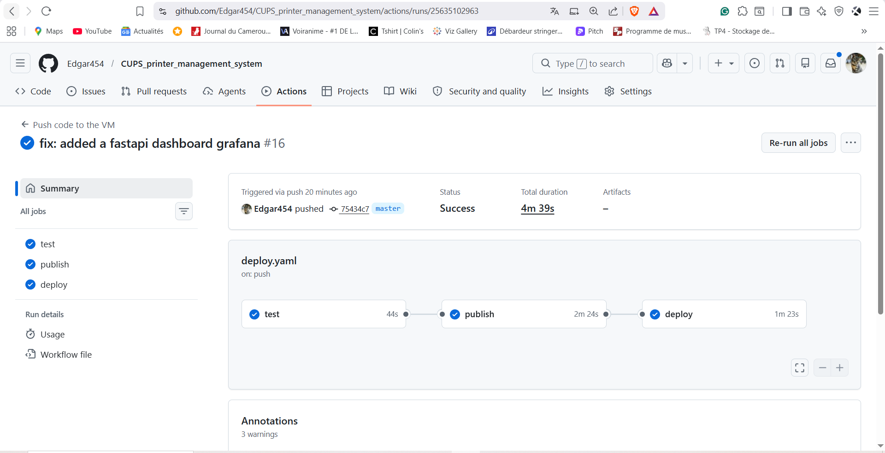
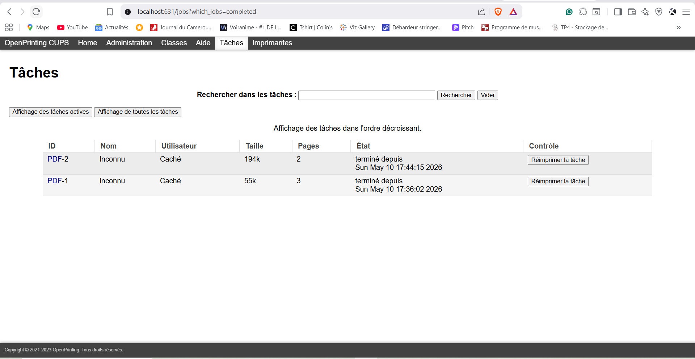

# 🖨️ CUPS Print Management Platform

Printing sounds simple until reliability becomes a requirement.

Once multiple users, printers, retries, failures, scheduling, and monitoring enter the picture, a “print button” becomes a distributed workflow problem.

This project is a containerized print management platform built around CUPS, PostgreSQL, and FastAPI. It focuses on making print operations observable, recoverable, and traceable — while interacting with real IPP printers and asynchronous workers.

The platform handles:

* print job orchestration
* printer management
* asynchronous processing
* failure recovery
* job tracking and observability

while exposing the full lifecycle of a print job through metrics, events, and distributed traces.

In local deployments, the average time between API submission and CUPS execution is approximately **33ms**, while printer discovery typically ranges from microseconds to around **10ms** depending on the network environment.


---

## 🎥 Demo

https://github.com/user-attachments/assets/b35b67a2-9ebc-433b-bffa-d7c52fff4c96

---

## ⚙️ Operational Characteristics

* Average API → CUPS dispatch latency: ~33ms
* Printer discovery latency: microseconds → ~10ms
* Real-time dispatch using PostgreSQL `LISTEN/NOTIFY`
* Horizontally scalable workers using row-level locking
* Automatic recovery of abandoned jobs through lease expiration
* End-to-end distributed tracing across API, worker, and database layers
* Fully containerized local deployment with observability included

---

## 🔄 Print Job Lifecycle

1. A user submits a print request through the frontend
2. The API validates and stores the job inside PostgreSQL
3. PostgreSQL emits a `LISTEN/NOTIFY` event
4. Workers safely claim jobs using row-level locking
5. The processing pipeline sends the file to CUPS through IPP
6. Metrics, traces, and workflow events are collected throughout execution
7. Failed or abandoned jobs are automatically retried and recovered

---

## 🏗️ Architecture



The system is split into independent services with clear responsibilities:

| Component                   | Responsibility                                     |
| --------------------------- | -------------------------------------------------- |
| **Frontend** (React + Vite) | Job submission, printer management, monitoring     |
| **API** (FastAPI)           | Job orchestration, validation, scheduling          |
| **Processing Pipeline**     | Asynchronous worker executing print jobs           |
| **PostgreSQL**              | Workflow state, event storage, worker coordination |
| **CUPS Server**             | IPP communication and print execution              |
| **Dummy Printer**           | Simulated network printer using `ippeveprinter`    |
| **Observability Stack**     | Metrics, tracing, dashboards                       |

The platform runs entirely through Docker Compose and can be deployed locally as a complete environment.

---

## 🧠 Engineering Decisions

### Reliable Job Tracking

One of the biggest challenges in print systems is understanding what happened to a document after submission.

The platform treats PostgreSQL as the workflow authority rather than simple storage.

Every state transition is recorded as an immutable event while database functions enforce valid transitions centrally. This prevents workers or application bugs from bypassing workflow rules accidentally.

```text
QUEUED → PROCESSING → PRINTING → COMPLETED
                              ↘ FAILED
                              ↘ RETRY
```

This provides:

* auditability
* safer concurrent processing
* deterministic workflow transitions
* easier debugging and recovery
* complete workflow visibility



---

### Fast Dispatch Without Extra Infrastructure

Print jobs should start quickly, but introducing Kafka or RabbitMQ for a deployment of this size would add significant operational overhead.

Instead, PostgreSQL acts as the orchestration layer:

* `LISTEN/NOTIFY` provides real-time dispatch
* row locking coordinates workers safely
* scheduled recovery tasks handle abandoned jobs
* transactional updates guarantee workflow consistency

Workers react to notifications in near real time while periodic polling provides resilience in case notifications are missed during restarts or network interruptions.

---

### Preventing Duplicate Processing

Print workflows need to handle retries safely.

Each request carries a `client_request_id`, allowing the system to safely deduplicate repeated submissions and avoid accidental double printing.

---

### Coordinating Multiple Workers Safely

Multiple workers can process jobs concurrently without conflicting with each other.

Workers acquire time-limited ownership of jobs through PostgreSQL row locking (`FOR UPDATE SKIP LOCKED`) combined with lease expiration.

If a worker crashes or becomes unresponsive, scheduled recovery tasks detect expired locks and safely requeue unfinished work automatically.

This allows the system to scale horizontally without introducing a dedicated queueing platform.

---

### Understanding Failures Across Services

When a print fails, the important question is rarely “did the API return 200?”

The platform propagates OpenTelemetry trace context across services so a single trace can follow a document from API submission to worker execution and CUPS processing.



This makes failures easier to diagnose and exposes the full lifecycle of a print job.

---

### Recovery After Worker Crashes

Long-running asynchronous workflows must recover cleanly from interruptions.

Failed jobs can retry automatically with delayed requeueing, while periodic recovery tasks detect jobs stuck in processing and safely return them to the queue.

---

## 🔐 Security

The platform applies several infrastructure-level security measures:

* private Docker networking between services
* restricted CUPS administration access
* PostgreSQL role-based access control (RBAC)
* append-only event storage for audit integrity
* restricted CORS configuration

The stack is intended for trusted or internal environments.

---

## 🖼️ Screenshots

### Dashboard



### Observability Dashboard



### CI/CD Pipeline



The repository includes a CI/CD pipeline that automatically:

1. runs unit and integration tests
2. builds and publishes updated container images
3. connects to the deployment VM through SSH
4. redeploys the updated stack automatically

The manual `make` commands are mainly intended for local development and fallback deployment scenarios.

### CUPS Server



---

## 🧪 Testing

Integration tests run against a real PostgreSQL container using Testcontainers.

This allows the test suite to validate:

* PostgreSQL functions and triggers
* workflow transition enforcement
* idempotent job creation
* transactional behavior
* asynchronous workflow execution
* API integration against a real database engine

The project intentionally tests real database behavior instead of mocking core workflow logic.

---

## 📊 Observability

| Tool              | Purpose                                 |
| ----------------- | --------------------------------------- |
| **Prometheus**    | Metrics and health monitoring           |
| **Grafana Tempo** | Distributed tracing                     |
| **Grafana**       | Dashboards and visualization            |
| **PostgreSQL**    | Business metrics and workflow analytics |

The platform currently exposes three Grafana dashboards:

| Dashboard                    | Focus                                                  |
| ---------------------------- | ------------------------------------------------------ |
| **Master Dashboard**         | Global system health and workflow status               |
| **API / Pipeline Dashboard** | Job lifecycle tracking and distributed traces          |
| **PostgreSQL Dashboard**     | Direct monitoring of database activity and performance |

The monitoring stack focuses on operational questions such as:

* Are workers healthy?
* Are jobs stuck?
* What is the queue depth?
* Which part of the workflow failed?
* What is the average processing latency?

---

## 🚀 Quick Start

### Prerequisites

* Docker
* Docker Compose
* Make

### Start the platform

```bash
make run
```

### Start with observability stack

```bash
make up
```

### Build and publish images

```bash
make build-push TAG=latest
```

---

## 📁 Project Structure

```text
.
├── api/                        # FastAPI service
├── processing_pipeline/        # Async workers
├── cups_server/                # CUPS server configuration
├── dummy_printer/              # Simulated IPP printer
├── database/                   # Schema and migrations
├── printer-platform-ui/        # React frontend
├── observability/
│   ├── grafana/
│   ├── prometheus/
│   ├── tempo/
│   └── otel/
├── tests/
│   └── integration/
├── docker-compose.yaml
├── docker-compose.observability.yml
└── Makefile
```

---

## ⚠️ Current Limitations

* No authentication layer yet
* Limited resilience and chaos testing
* Integration tests mainly cover core workflows
* File lifecycle management could be improved

---

## 🧾 Closing Notes

This project started as a freelance assignment and evolved into a broader exploration of asynchronous systems and print infrastructure.

Beyond the application itself, it was an opportunity to work with:

* CUPS and IPP internals
* service discovery with Avahi
* distributed tracing with OpenTelemetry
* PostgreSQL coordination patterns
* containerized infrastructure
* fault-tolerant worker design

The result is a realistic backend platform focused on reliability, operational visibility, and workflow orchestration around real print infrastructure.
